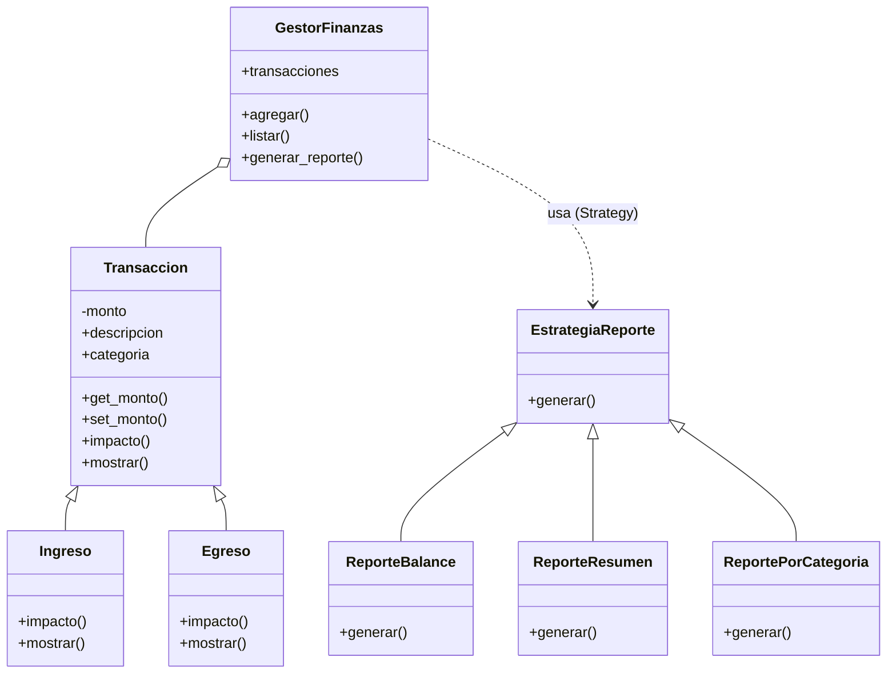

# TPI - Gestor de Finanzas Personales

Trabajo Práctico Integrador - Programación Avanzada (UNAB) - 2026

## Integrantes
- Machado Nicolas Perez
- Ruiz Celeste
- Pascolo Jeremias

## Descripción
Aplicación de consola para llevar el control de las finanzas personales.
Permite cargar ingresos y egresos, ver el estado actual (balance) y generar
distintos reportes (resumen y por categoría).

## Diagrama de clases (UML)



## Conceptos aplicados
- **Programación Orientada a Objetos**
  - Abstracción: la clase `Transaccion` define la base común.
  - Encapsulamiento: el monto es privado (`_monto`) y se accede con getter/setter.
  - Herencia: `Ingreso` y `Egreso` heredan de `Transaccion` (relación "es un").
  - Polimorfismo: cada transacción redefine `impacto()` (un ingreso suma, un egreso resta).
- **Relación entre objetos**
  - Composición: `GestorFinanzas` contiene una lista de `Transaccion`.
- **Patrón de diseño**
  - Strategy: los reportes (`ReporteBalance`, `ReporteResumen`, `ReportePorCategoria`)
    son estrategias intercambiables. El gestor no sabe cómo se arma el reporte,
    solo le pide a la estrategia que lo genere.
- **Decorador**
  - `registrar_carga`: agrega mensajes al cargar una transacción sin modificar
    el código del método `agregar` del gestor.

## Estructura del proyecto
```
tpi_finanzas/
├── README.md
└── src/
    ├── transacciones.py   (Transaccion, Ingreso, Egreso)
    ├── estrategias.py     (patrón Strategy: reportes)
    ├── decoradores.py     (decorador registrar_carga)
    ├── gestor.py          (GestorFinanzas)
    └── main.py            (menú de consola)
```

## Cómo ejecutar
1. Tener Python 3 instalado.
2. Abrir una terminal dentro de la carpeta `src`.
3. Ejecutar:
```
python main.py
```
4. Usar el menú para cargar ingresos/egresos y ver los reportes.
